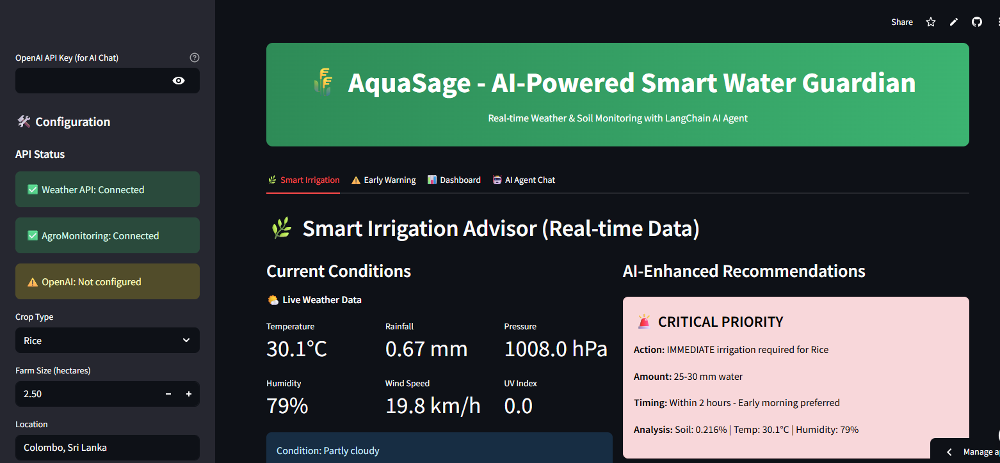

# 🧠 Autonomous Reasoning AI Agent

> 🔗 **Link for the app**: [YouTube Short](https://aqua-sage.streamlit.app/)
> > 🔗 **Watch the 60-second demo**: [YouTube Short](https://youtube.com/shorts/your_video_link)




This repository showcases an autonomous AI agent designed to demonstrate advanced reasoning, memory, planning, and interaction. Built using Python and key libraries such as **LangChain**, **OpenAI**, and **Streamlit**, this agent supports interactive user communication with reflective capabilities and persistent memory.

| Criterion | How This Project Meets It |
|----------|----------------------------|
| **Problem Definition & Motivation** | The agent is designed to simulate cognitive reasoning and memory recall—helpful in tasks like tutoring, research, and decision support. |
| **Creativity & Usefulness** | The agent reflects on its own responses, uses memory (FAISS), and calls tools dynamically. |
| **Technical Implementation** | Clean modular code using LangChain, OpenAI, and Streamlit. Demonstrates looped reasoning and tool use. |
| **Video Clarity** | YouTube Short clearly presents agent behavior, tool use, memory usage, and interaction cycle. |
| **Presentation Quality** | Professional-quality video, code organization, and visual flowchart included below. |

---

## 🧩 Agent Workflow Diagram

```mermaid
graph TD
    A[User Input via Streamlit] --> B[agent.py: Initialize LangChain Agent]
    B --> C{Need External Info?}
    C -- Yes --> D[tools.py: Use Tools (e.g., Search)]
    C -- No --> E[Internal Reasoning]
    D --> F[Reflect on Output]
    E --> F
    F --> G[memory.py: Store in FAISS Memory]
    G --> H[Display Final Answer in Streamlit]

## 🧠 Key Features

* 🔁 **Reflective Reasoning**: The agent uses internal memory to reflect on and revise responses.
* 🧠 **Memory (FAISS)**: Stores conversations for persistent, context-aware interaction.
* 🧰 **Tool Integration**: Dynamically uses tools for factual knowledge via `tools.py`.
* 📊 **User-Friendly Interface**: Built with Streamlit for easy interaction.

---

## 🎬 YouTube Demo

> 🔗 **Watch the 60-second demo**: [YouTube Short](https://youtube.com/shorts/your_video_link)


---

## 🔮 Future Improvements

* 🎤 Add voice interaction
* 🌐 More external tools (e.g., current news, calendar integration)
* 🤖 Multi-agent collaboration
